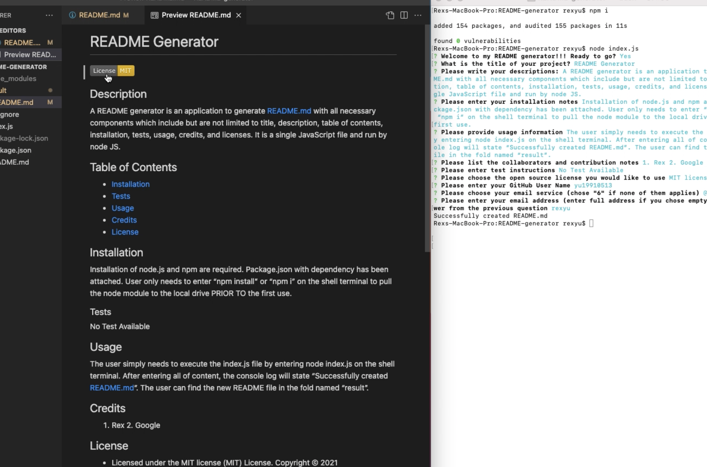

# README Generator
[](https://opensource.org/licenses/MIT)
## Description
A README generator is an application to generate README.md with all necessary components which include but are not limited to title, description, table of contents, installation, tests, usage, credits, and licenses. It is a single JavaScript file and run by node JS.
## Table of Contents
- [Installation](#installation)
- [Tests](#tests)
- [Usage](#usage)
- [Credits](#credits)
- [License](#license)
## Installation
Installation of node.js and npm are required. Package.json with dependency has been attached. User only needs to enter “npm install” or “npm i” on the shell terminal to pull the node module to the local drive PRIOR TO the first use.

### Tests
No Test Available

## Usage
The user simply needs to execute the index.js file by entering node index.js on the shell terminal. After entering all of content, the console log will state “Successfully created README.md”. The user can find the new README file in the fold named “result”.

```md

```

## Credits
1. Rex 2. Google

## License
* Licensed under the MIT license (MIT) License. Copyright © 2021
---
## Contacts
GitHub: [yu19910513](https://github.com/yu19910513/)

Email: [rexyu@uw.edu](mailto:rexyu@uw.edu)

## MIT License

Permission is hereby granted, free of charge, to any person obtaining a copy of this software and associated documentation files (the "Software"), to deal in the Software without restriction, including without limitation the rights to use, copy, modify, merge, publish, distribute, sublicense, and/or sell copies of the Software, and to permit persons to whom the Software is furnished to do so, subject to the following conditions:

The above copyright notice and this permission notice shall be included in all copies or substantial portions of the Software.

THE SOFTWARE IS PROVIDED "AS IS", WITHOUT WARRANTY OF ANY KIND, EXPRESS OR IMPLIED, INCLUDING BUT NOT LIMITED TO THE WARRANTIES OF MERCHANTABILITY, FITNESS FOR A PARTICULAR PURPOSE AND NONINFRINGEMENT. IN NO EVENT SHALL THE AUTHORS OR COPYRIGHT HOLDERS BE LIABLE FOR ANY CLAIM, DAMAGES OR OTHER LIABILITY, WHETHER IN AN ACTION OF CONTRACT, TORT OR OTHERWISE, ARISING FROM, OUT OF OR IN CONNECTION WITH THE SOFTWARE OR THE USE OR OTHER DEALINGS IN THE SOFTWARE.

[](https://opensource.org/licenses/MIT)

©2021 Rex Yu
